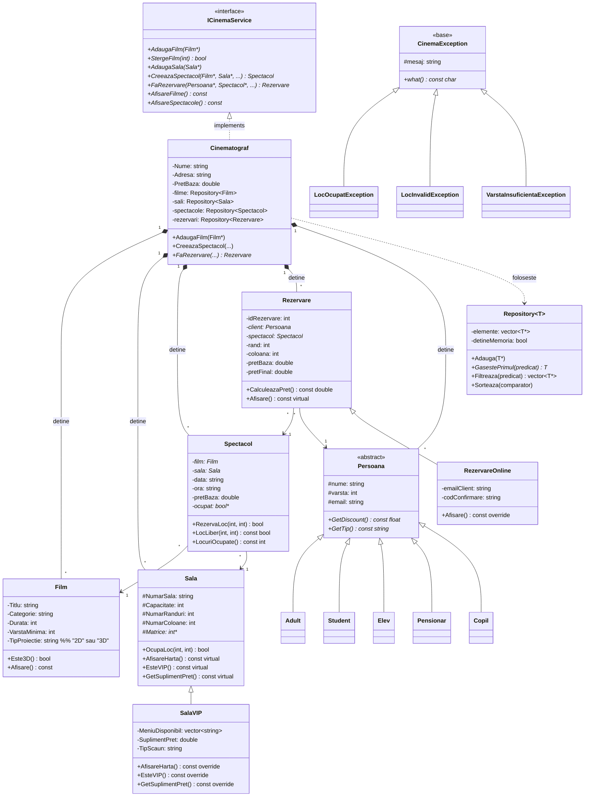
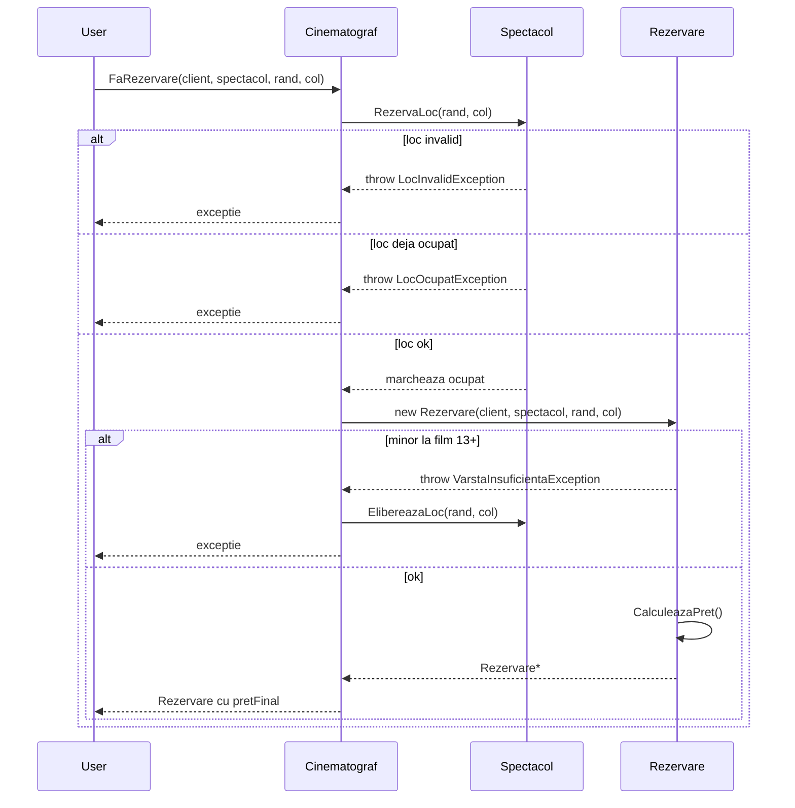

# Documentatie tehnica - Sistem de Rezervari Cinema

> Tema 3121B - Programare Orientata pe Obiecte (C++).
> Document insotitor pentru codul sursa.

## Cuprins

1. Diagrama UML
2. Descrierea claselor
3. Concepte POO aplicate
4. Fluxul unei rezervari
5. Formula de calcul a pretului
6. Ierarhia exceptiilor
7. Strategie de testare
8. Posibile imbunatatiri

---

## 1. Diagrama UML

Diagrama de mai jos prezinta relatiile principale dintre clase. Este scrisa
in [Mermaid](https://mermaid-js.github.io/), si se randeaza automat pe
GitHub / GitLab.



---

## 2. Descrierea claselor

### `Film`
Reprezinta un film proiectat in cinema. Atribute: titlu, categorie, durata
(minute), varsta minima, limba, regizor, an, rating, poster (URL), tip
proiectie (`"2D"` sau `"3D"`). Are operatori `==`, `<`, `<<` pentru sortare
si afisare. Metoda `Este3D()` este folosita la calculul pretului.

### `Sala`
Sala fizica de cinema. Are un identificator (`NumarSala`), capacitate,
numar de randuri si coloane, plus o **matrice dinamica** `int** Matrice`
care reprezinta starea fiecarui loc. Aloca memoria in constructor si o
elibereaza in destructor (RAII). Metode cheie: `OcupaLoc()`,
`VerificaDisponibilitate()`, `AfisareHarta()`. Metode `virtual` permit
specializarea in `SalaVIP`.

### `SalaVIP`
Mostenire publica din `Sala`. Adauga supliment de pret, tip scaun
(`"Recliner"`), si o lista de produse de meniu disponibile. Suprascrie
`Afisare()`, `AfisareHarta()`, `EsteVIP()`, `GetSuplimentPret()`.

### `Spectacol`
Un film proiectat intr-o sala la o anumita data si ora. Are propria
matrice `bool** ocupat` pentru a permite mai multe spectacole in aceeasi
sala (in zile diferite). Metodele `RezervaLoc()` si `LocLiber()` arunca
`LocInvalidException` sau `LocOcupatException`.

### `Persoana` (abstracta)
Baza pentru clientii cinematografului. Metode `pure virtuale`:
`GetDiscount()` si `GetTip()`. Subclasele `Adult`, `Student`, `Elev`,
`Pensionar`, `Copil` definesc discount-uri diferite (0%, 20%, 15%, 30%,
50%).

### `Rezervare`
Un bilet emis pentru un client la un spectacol, pentru un loc anume.
Calculeaza automat pretul aplicand toate regulile (zi, tip film, tip
sala, tip client, loc VIP). Stocheaza atat `pretBaza` cat si `pretFinal`,
plus data emiterii.

### `RezervareOnline`
Mostenire publica din `Rezervare`. Adauga `emailClient` si genereaza
automat un cod de confirmare (`ONL-XXXX-id`). Suprascrie `Afisare()`
pentru a include informatiile online.

### `Cinematograf`
Clasa centrala. Detine si gestioneaza toate colectiile (filme, sali,
spectacole, rezervari, clienti) prin `Repository<T>`. Implementeaza
**ICinemaService** (interfata abstracta cu metode pure virtuale).
Ofera operatii de cautare, creare, stergere si afisare.

### `ICinemaService` (interfata)
Defineste contractul pentru orice serviciu de cinema. Toate metodele sunt
**pure virtuale** (`= 0`). Permite scrierea de cod polimorfic care lucreaza
cu orice implementare (`Cinematograf`, `CinemaOnline`, mock-uri pentru
teste etc.).

### `Repository<T>` (template)
Colectie generica. Pastreaza `vector<T*>` si stie daca detine sau nu
memoria (parametru in constructor). Ofera `Adauga`, `Sterge`,
`GasestePrimul(predicat)`, `Filtreaza(predicat)`, `Sorteaza(comparator)`.
Predicate sunt `std::function<bool(const T*)>`, deci se accepta
lambda-uri.

### `Angajat`, `Manager`, `Casier`, `Administrator`
Ierarhie paralela pentru personalul cinematografului. Fiecare rol are
drepturi diferite, verificate de `SistemAutentificare` prin metode
`VerificaDrepturi*()` care arunca `DrepturiInsuficienteException`.

### `Persistenta`
Clasa cu metode statice pentru salvare/incarcare in fisiere text (`.txt`)
cu format `key|value` per linie. Permite reluarea starii intre rulari.

### `Raport`
Calculeaza statistici pe baza datelor din `Cinematograf`: top filme dupa
numar de rezervari, statistici per sala, per categorie de film, per zi.

---

## 3. Concepte POO aplicate

### Incapsulare
Atributele sunt `private`/`protected`. Acces strict prin getter-i / setter-i.
Constructorii valideaza datele si arunca exceptii la valori invalide
(ex: pret negativ, sala null).

### Mostenire
- `SalaVIP : public Sala`
- `RezervareOnline : public Rezervare`
- `Adult / Student / Elev / Pensionar / Copil : public Persoana`
- `Manager / Casier / Administrator : public Angajat`
- `Cinematograf : public ICinemaService`
- Exceptiile: `LocOcupatException : public CinemaException`, etc.

### Polimorfism
Metode `virtual` in clasele de baza, suprascrise in derivate:
- `Sala::AfisareHarta()`, `EsteVIP()`, `GetSuplimentPret()`
- `Persoana::GetDiscount()`, `GetTip()` (pure virtuale)
- `Rezervare::Afisare()` -> `RezervareOnline::Afisare()`

Apelul prin pointer la clasa de baza activeaza versiunea corecta:
```cpp
Sala* s = new SalaVIP(...);
s->AfisareHarta();           // apeleaza SalaVIP::AfisareHarta
```

### Sabloane (templates)
`Repository<T>` este o clasa template parametrizata cu tipul stocat.
Foloseste `std::function` pentru predicate / comparatoare, permitand
folosirea de lambda-uri:
```cpp
auto drame = repo.Filtreaza([](const Film* f) {
    return f->GetCategorie() == "Drama";
});
```

### Exceptii
Toate exceptiile mostenesc din `CinemaException : public std::exception`.
Hierarchy clara: `LocOcupatException`, `LocInvalidException`,
`VarstaInsuficientaException`, `DateInvalideException`, `FisierException`,
`AutentificareException`, `DrepturiInsuficienteException`,
`ElementInexistentException`.

Fiecare exceptie are mesaj precompilat in constructor + getter-e pentru
detalii (ex: `LocOcupatException::GetRand()`).

### Operator overloading
- `operator<<` pentru afisare in `ostream` (toate clasele majore)
- `operator==`, `operator<` pentru `Film` (sortare alfabetica)
- `operator<` pentru `Spectacol` (sortare dupa data + ora)
- `operator=` cu auto-asignare safe pentru clase cu memorie dinamica

### Constructor de copiere si destructor (Rule of Three)
Pentru clase care detin memorie dinamica (`Sala`, `Spectacol`):
- Constructor de copiere face *deep copy* al matricei
- `operator=` elibereaza memoria veche, apoi face deep copy
- Destructorul elibereaza matricea

---

## 4. Fluxul unei rezervari



---

## 5. Formula de calcul a pretului

```
pretFinal = pretBaza
          * (1 - discount_client)            // Adult 0%, Student 20%, ...
          * (loc_VIP ? 1.30 : 1.0)           // ultimele 2 randuri in sala normala
          * (sala_VIP ? 1.50 : 1.0)          // sala intreaga VIP
          * (este_3D ? 1.20 : 1.0)           // supliment 3D
          * (este_vineri ? 0.50 :            // reducere vineri
             este_weekend ? 1.10 :           // supliment weekend
             1.00)                           // zi obisnuita
```

Zilele se calculeaza din `Spectacol::data` (format `"YYYY-MM-DD"`)
folosind algoritmul Zeller, deci sunt deterministe si testabile.

### Exemple

| Pret baza | Client | Tip film | Zi | Sala | Pret final |
|-----------|--------|----------|-------|------|------------|
| 30 RON | Adult | 2D | Marti | normala | 30.00 RON |
| 30 RON | Student | 2D | Marti | normala | 24.00 RON |
| 30 RON | Adult | 3D | Marti | normala | 36.00 RON |
| 30 RON | Adult | 2D | Vineri | normala | 15.00 RON |
| 30 RON | Adult | 2D | Sambata | normala | 33.00 RON |
| 30 RON | Adult | 2D | Marti | VIP | 45.00 RON |

---

## 6. Ierarhia exceptiilor

```
std::exception
└── CinemaException
    ├── LocOcupatException        (loc deja rezervat)
    ├── LocInvalidException       (rand/col in afara salii)
    ├── VarstaInsuficientaException (client sub varsta minima)
    ├── DateInvalideException    (pret negativ, null pointer, ...)
    ├── AutentificareException   (login esuat)
    ├── DrepturiInsuficienteException  (rol fara permisiune)
    ├── ElementInexistentException (sala/film negasit)
    └── FisierException          (eroare I/O)
```

Toate sunt prinse selectiv in cod (`catch (LocOcupatException&)`) sau
generic (`catch (CinemaException&)`).

---

## 7. Strategie de testare

Suite-ul `tests/test_cinema.cpp` foloseste un mini-framework propriu
(macro-uri `ASSERT_TRUE`, `ASSERT_EQ`, `ASSERT_NEAR`, `ASSERT_THROWS`).

**17 teste**, **42 assertii**, fara dependinte externe:
1. `Film` - constructor + getter-i.
2. `Sala` - alocare matrice, ocupare, verificare.
3. `SalaVIP` - mostenire + polimorfism prin pointer la baza.
4. `Repository<T>` - template, predicate, filtrare.
5. Rezervare valida - locul devine ocupat.
6. `LocOcupatException` - acelasi loc de doua ori.
7. `LocInvalidException` - loc in afara salii.
8. `VarstaInsuficientaException` - minor la film 13+, locul ramane liber.
9. Pret 2D vs 3D (3D = 1.20 x 2D).
10. Pret Student (-20%).
11. Pret Vineri (-50%) - bazat pe data spectacolului.
12. Pret Weekend (+10%) - bazat pe data spectacolului.
13. Pret Sala VIP (+50%).
14. `RezervareOnline` - email + cod confirmare unic.
15. Cautari `Cinematograf` dupa ID si nume.
16. Polimorfism `ICinemaService*` -> `Cinematograf`.
17. Statistici `Spectacol` - locuri ocupate / procent ocupare.

---

## 8. Posibile imbunatatiri

1. **Smart pointers**. Inlocuirea `new`/`delete` cu `std::unique_ptr` /
   `std::shared_ptr` ar elimina riscul de memory leak la exceptii.
2. **Persistenta JSON**. Format mai robust decat `key|value` (de exemplu
   prin nlohmann/json), cu validare schema.
3. **Concurenta**. Daca mai multi casieri rezerva simultan in productie,
   ar trebui un mutex pe `Spectacol::ocupat` sau o tranzactie atomica.
4. **GUI cross-platform**. Versiunea actuala Windows Forms este legata de
   `.NET` (C++/CLI). O alternativa portabila ar fi Qt sau wxWidgets.
5. **Internationalizare**. Mesajele sunt in romana. O fisier `messages.po`
   ar permite traducere usoara.
6. **API REST**. Expunerea `ICinemaService` printr-un server HTTP
   (e.g. Crow, Pistache) ar permite rezervari din web/mobile.
7. **Test coverage**. Suite-ul actual acopera logica de baza; ar putea
   creste prin teste pentru `Persistenta`, `Raport`, `SistemAutentificare`.
8. **Lint si formatare**. Integrare `clang-format` + `clang-tidy` ar
   uniformiza stilul si ar prinde automat unele anti-pattern-uri.

---

*Document realizat ca parte din proiectul de POO. Pentru codul sursa,
vezi fisierele din radacina repository-ului.*
